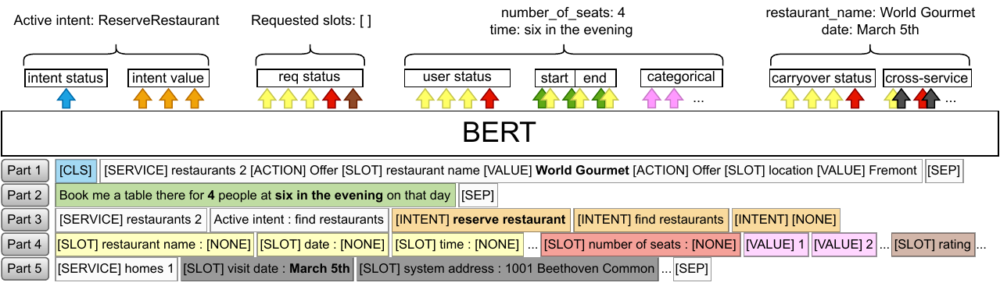

# Description

This repo contains the source code for the INTERSPEECH 2022 paper ["A Multi-Task BERT Model for Schema-Guided Dialogue State Tracking"](https://arxiv.org/abs/2207.00828).
This was part of the work for my NTUA thesis affiliated with the SLP-NTUA lab, which you can find [here](http://artemis.cslab.ece.ntua.gr:8080/jspui/handle/123456789/18337).



# Abstract

Task-oriented dialogue systems often employ a Dialogue State
Tracker (DST) to successfully complete conversations. Recent
state-of-the-art DST implementations rely on schemata of diverse services to improve model robustness and handle
zero-shot generalization to new domains, however such methods typically require multiple large scale transformer models
and long input sequences to perform well. We propose a single multi-task BERT-based model that jointly solves the three
DST tasks of intent prediction, requested slot prediction and
slot filling. Moreover, we propose an efficient and parsimonious encoding of the dialogue history and service schemata
that is shown to further improve performance. Evaluation on
the SGD dataset shows that our approach outperforms the baseline SGP-DST by a large margin and performs well compared
to the state-of-the-art, while being significantly more computationally efficient. Extensive ablation studies are performed to
examine the contributing factors to the success of our model.

# Dependencies

Create a virtual environment (the code has been tested in Python 3.10) and install the dependencies:

```
pip install -r requirements.txt
```

# Configuration

Training can be configured by modifying the file `mtsgdst/config.py`.

# Create datasets

Download the SGD dataset:
```
git clone https://github.com/google-research-datasets/dstc8-schema-guided-dialogue
```

Create and save the datasets to pickles.
The `eval_mode` flag controls whether the dataset uses the ground-truth previous dialogue states and the `augment` flag controls whether data augmentation (schema augmentation and word dropout) is applied.

```
python -m mtsgdst.data.pytorch_dataset --dataset_split=train --augment
python -m mtsgdst.data.pytorch_dataset --dataset_split=dev
python -m mtsgdst.data.pytorch_dataset --dataset_split=dev --eval_mode
python -m mtsgdst.data.pytorch_dataset --dataset_split=test --eval_mode
```

# Training

*You can find a trained model checkpoint and the full result metrics [here](https://huggingface.co/lefteris12/multitask-schema-guided-dst).*

Train the model for a total of 5 epochs and evaluate every 4k steps on the dev set:

```
python -m mtsgdst.train --num_epochs=5 --num_total_epochs=5 --num_steps_logging=4000
```

After every evaluation on the dev set, `checkpoints/latest.pt` is the latest checkpoint and `checkpoints/best.pt` is the best checkpoint so far.
   
It is possible to continue training from checkpoints.
For example:

```
python -m mtsgdst.train --num_epochs=2 --num_total_epochs=5 --num_steps_logging=4000
python -m mtsgdst.train --num_epochs=5 --num_total_epochs=5 --num_steps_logging=4000 --load_checkpoint_path='checkpoints/latest.pt'
```

# Evaluation on the test set

Evaluate on the test set using the [scripts](https://github.com/google-research/google-research/tree/master/schema_guided_dst) provided by the SGD-baseline:
```
python -m mtsgdst.dst --checkpoint_path='checkpoints/best.pt'
```

# Citation

Cite as: Kapelonis, E., Georgiou, E., Potamianos, A. (2022) A Multi-Task BERT Model for Schema-Guided Dialogue State Tracking. Proc. Interspeech 2022, 2733-2737, doi: 10.21437/Interspeech.2022-10852

```
@inproceedings{kapelonis22_interspeech,
  author={Eleftherios Kapelonis and Efthymios Georgiou and Alexandros Potamianos},
  title={{A Multi-Task BERT Model for Schema-Guided Dialogue State Tracking}},
  year=2022,
  booktitle={Proc. Interspeech 2022},
  pages={2733--2737},
  doi={10.21437/Interspeech.2022-10852}
}
```
